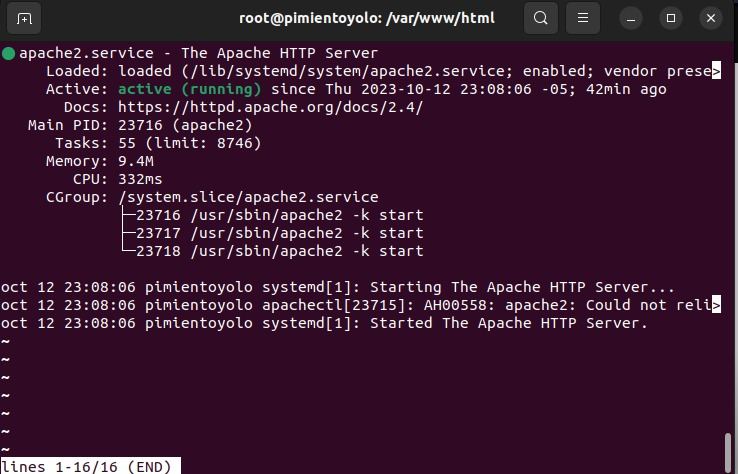
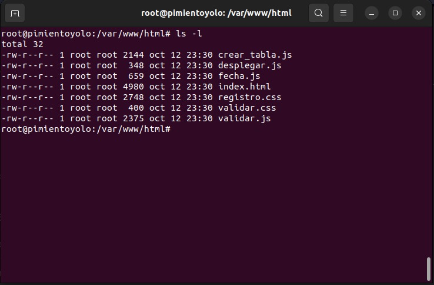
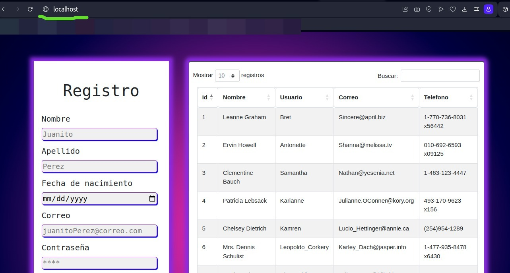
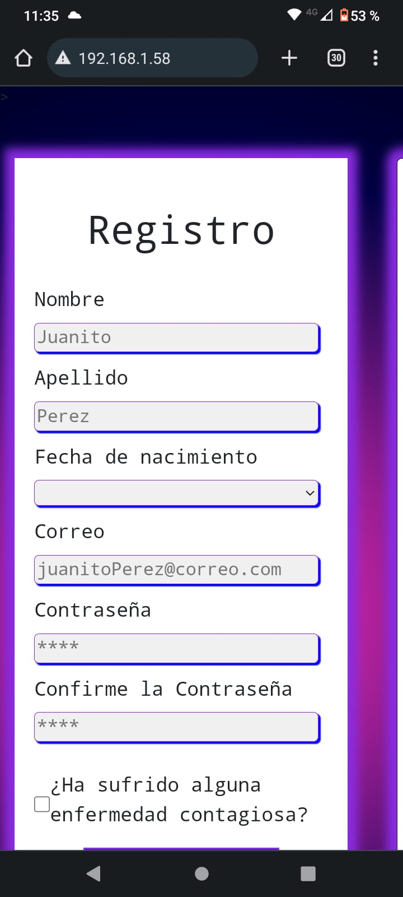
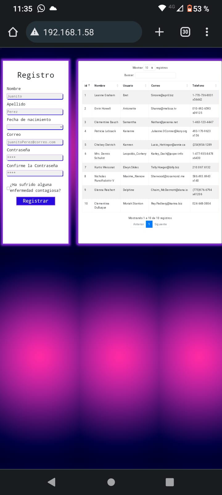

# Este archivo es para mejorar la presentacion de la pruebas:

### Imagen de que apache se ha montado y esta en ejecucion:

### Imagen de los archivos de la pagina montados en la carpeta de apache:

### Imagen de la pagina en el computador usando "LocalHost":

### Imagenes de la pagina visualizada desde un celular, conectado a la misma red, con la ip del computador:

